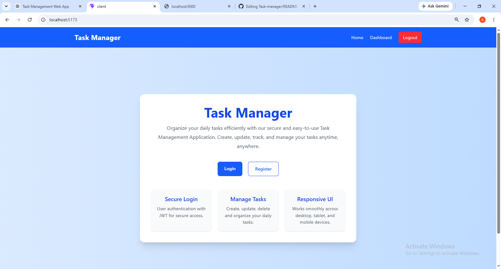
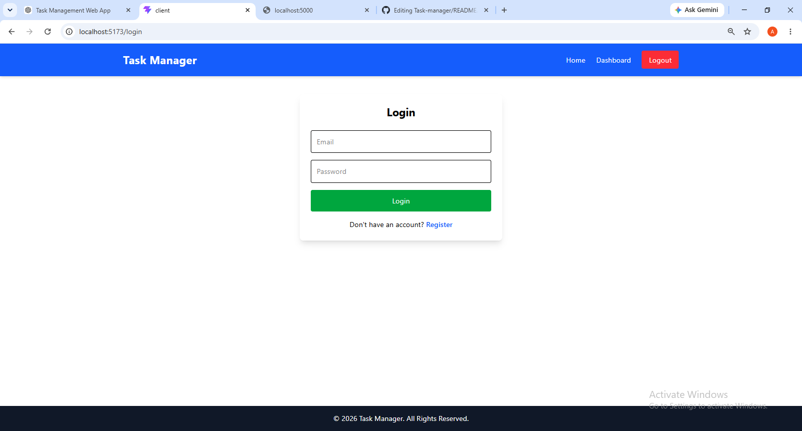
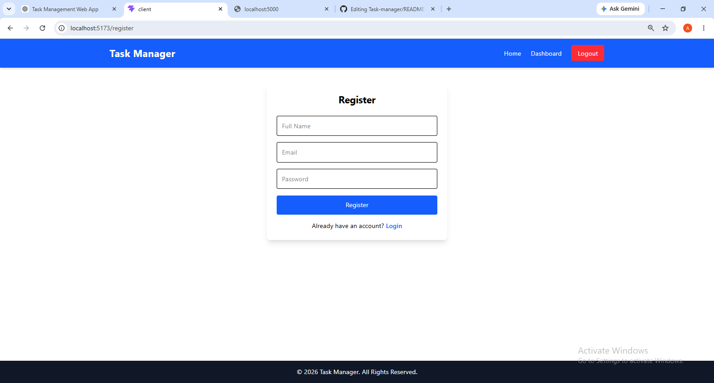
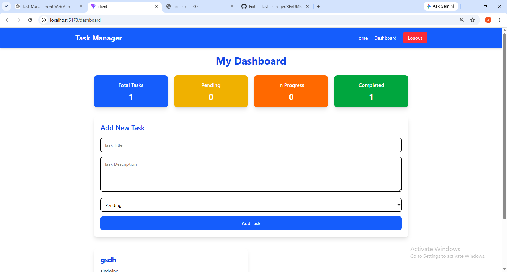

# 📌 Task Manager Application

A full-stack Task Manager Application built using the MERN Stack (MongoDB, Express.js, React.js, and Node.js). This application allows users to securely manage their daily tasks with authentication and complete CRUD functionality.

---

## 🚀 Features

### 🔐 User Authentication
- User Registration
- User Login
- JWT Authentication
- Protected Routes
- Logout Functionality

### 📝 Task Management
- Create Tasks
- View All Tasks
- Update Existing Tasks
- Delete Tasks
- Task Status Management
  - Pending
  - In Progress
  - Completed

### 📊 Dashboard
- Total Tasks Counter
- Pending Tasks Counter
- In Progress Tasks Counter
- Completed Tasks Counter
- Responsive Dashboard Design

### 🎨 Responsive UI
- Mobile Friendly
- Tablet Friendly
- Desktop Friendly
- Built with Tailwind CSS

---

## 🛠️ Tech Stack

### Frontend
- React.js
- React Router DOM
- Axios
- Tailwind CSS
- Context API

### Backend
- Node.js
- Express.js
- MongoDB Atlas
- Mongoose
- JWT Authentication
- bcryptjs
- dotenv
- CORS

---

## 📂 Project Structure

```
Task-Manager/
│
├── client/
│   ├── src/
│   ├── components/
│   ├── pages/
│   ├── context/
│   ├── layouts/
│   ├── services/
│   └── App.jsx
│
├── server/
│   ├── config/
│   ├── controllers/
│   ├── middleware/
│   ├── models/
│   ├── routes/
│   ├── .env
│   └── server.js
│
└── README.md
```

---

## ⚙️ Installation

### Clone Repository

```bash
git clone https://github.com/your-username/task-manager.git
```

### Backend Setup

```bash
cd server
npm install
```

Create a **.env** file

```env
PORT=5000

MONGODB_URI=your_mongodb_connection_string

JWT_SECRET=your_secret_key
```

Run Backend

```bash
npm run dev
```

---

### Frontend Setup

```bash
cd client
npm install
npm run dev
```

Frontend runs on

```
http://localhost:5173
```

Backend runs on

```
http://localhost:5000
```

---

## 🔑 API Endpoints

### Authentication

| Method | Endpoint | Description |
|---------|----------|-------------|
| POST | /api/auth/register | Register User |
| POST | /api/auth/login | Login User |

### Tasks

| Method | Endpoint | Description |
|---------|----------|-------------|
| GET | /api/tasks | Get All Tasks |
| POST | /api/tasks | Create Task |
| PUT | /api/tasks/:id | Update Task |
| DELETE | /api/tasks/:id | Delete Task |

---

## 📸 Screenshots

### Home Page


### Login Page


### Register Page


### Dashboard


---

## 📖 Learning Outcomes

- MERN Stack Development
- REST API Integration
- MongoDB Atlas
- JWT Authentication
- CRUD Operations
- Protected Routes
- State Management using Context API
- Responsive UI Design

---

## 👩‍💻 Author

**Anita Pandey**

B.Tech Computer Science Engineering

Graphic Era Hill University, Bhimtal

---

## 📄 License

This project is developed for learning and internship purposes.
